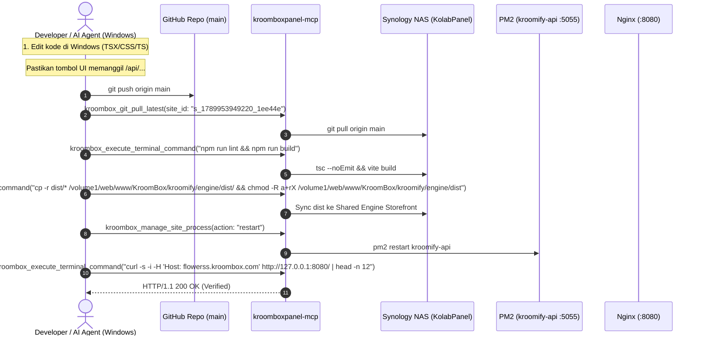

# AGENTS.md — Micro CMS Kroomify (Windows Dev & Kroombox Panel MCP Guide)

> **PANDUAN OPERASIONAL & ATURAN PENGEMBANGAN AI AGENT**  
> Berkas ini adalah **single source of truth** bagi AI Agent (Cursor, Claude Code, Cline, Antigravity CLI `agy`, dll.) yang mendampingi developer yang bekerja di lingkungan **Windows**, mengelola **Micro CMS Kroomify**, dan berinteraksi dengan server Synology NAS melalui **`kroomboxpanel-mcp`**.

---

## ⚠️ KASUS NYATA & INVARIAN PENTING: MENGAPA TOMBOL PUBLISH SEMPAT TIDAK BERFUNGSI

> [!CAUTION]
> **MASALAH SEBELUMNYA:**
> Saat fitur *"Publish Toko"* dibuat oleh AI agent di Windows, tombol Publish di antarmuka (`PublishStoreModal.tsx`) **hanya meng-update database Supabase** (`stores.is_published = true`) secara client-side, dan sama sekali **TIDAK TERHUBUNG** ke backend API.  
> Akibatnya:
> 1. Webroot fisik di NAS (`/volume1/web/www/KroomBox/kroomify/sites/<slug>`) **tidak pernah dibuat**.
> 2. Virtual host Nginx di `/etc/nginx/sites-enabled/` **tidak pernah di-generate**.
> 3. Cloudflare Tunnel Ingress **tidak terdaftar**.
> 4. Saat pengunjung membuka `https://<slug>.kroombox.com`, Nginx menampilkan halaman default *"Kroombox - Success"*.

### 🔒 INVARIAN MUTLAK:
1. **Kroomify BUKAN Serverless / Frontend-Only SPA**: Kroomify memiliki backend daemon Express aktif (`kroomify-api` port `5055`) di server NAS.
2. **Setiap Aksi Fisik Wajib Memanggil Backend API**:
   - Aksi **Publish Toko** Wajib memanggil `POST /api/deploy/publish`.
   - Aksi **Unpublish Toko** Wajib memanggil `POST /api/deploy/unpublish`.
   - Aksi **Midtrans Payment** Wajib memanggil `POST /api/midtrans/snap-token`.
   - Aksi **Biteship Ongkir** Wajib memanggil `POST /api/shipping/rates`.
   - Aksi **Notifikasi Email** Wajib memanggil `POST /api/send-email`.
   DILARANG KERAS hanya melakukan simulasi state di Supabase tanpa mengeksekusi endpoint backend terkait!

---

## 1. Topologi Lingkungan & Identitas KolabPanel

| Entitas | Detail / Nilai | Catatan Operasional |
|---|---|---|
| **Workstation Developer** | **Windows OS** (PC Lokal) | Tempat developer mengedit kode sumber, menjalankan Git, atau `npm run dev` |
| **Server Host Target** | **Synology NAS DS923+** (Linux DSM 7.2) | IP ZeroTier: `100.90.80.70` \| IP LAN: `192.168.137.1` |
| **Orchestrator Panel** | **KolabPanel v1** (Kroombox Panel) | Panel SaaS multi-tenant yang mengelola hosting dan daemon |
| **KolabPanel Site ID** | **`s_1789953949220_1ee44e`** | **Wajib dipakai pada seluruh parameter `site_id` tool MCP** |
| **User Pemilik Situs** | `akun@kroombox.com` (`u_1789869733181`) | Akun tenant di KolabPanel |
| **Direktori Proyek di NAS** | `/volume1/web/www/KOLABPANEL_USERS/akun@kroombox.com/Micro_CMS_Kromify` | Root working directory aplikasi |
| **Domain Utama CMS** | `https://kroomify.kroombox.com` | Dashboard admin & merchant login |
| **Subdomain Toko Merchant** | `https://<slug>.kroombox.com` | Storefront publik langsung tanpa login CMS |
| **Backend Express Daemon** | PM2 Process: `kroomify-api` (Port `5055`) | Runtime Node.js untuk API dan deploy controller |
| **Gateway Reverse Proxy** | Nginx DSM (Port `8080`) | Meneruskan traffic publik ke static webroot atau port 5055 |
| **Cloudflare Anycast Tunnel**| Tunnel ID: `19956650-74b4-4479-9c22-79da749256da` | Ingress edge routing publik ke `http://localhost:8080` |

---

## 2. Katalog Backend API Kroomify (Wajib Di-wire oleh Frontend)

Seluruh request API dari frontend dikirim ke path relatif `/api/...`. Nginx port 8080 secara otomatis mem-proxy `/api/` ke backend Express port 5055 (`proxy_pass http://127.0.0.1:5055/;`).

### 2.1 Endpoint Auto-Deployer (`backend/deployController.ts`)

#### A. Publish Toko (`POST /api/deploy/publish`)
* **Dipanggil oleh**: `PublishStoreModal.tsx` saat merchant klik tombol "Publish Toko".
* **Request Payload**:
  ```json
  {
    "slug": "flowerss",
    "baseDomain": "kroombox.com",
    "customDomain": "optional-custom.com",
    "store": { "id": "...", "name": "Flowerss Shop", "slug": "flowerss" },
    "products": [ { "id": "...", "name": "Mawar Merah", "price": 50000 } ]
  }
  ```
* **Eksekusi Fisik Backend**:
  1. `sitePackager.packageStoreSite()`: Menyiapkan `/volume1/web/www/KroomBox/kroomify/sites/<slug>/`, menulis `store.json`, `products.json`, menginjeksi OpenGraph tags ke `index.html`, dan membuat symlink `assets -> ../../engine/dist/assets`.
  2. `nginxDeployer.deployVhost()`: Membuat `/etc/nginx/sites-available/kroomify-<slug>.conf`, symlink ke `sites-enabled/`, uji sintaks `sudo /usr/sbin/nginx -t`, dan reload `sudo /usr/sbin/nginx -s reload`.
  3. `cloudflareDeployer.deployHostname()`: Mendaftarkan ingress Cloudflare Tunnel dan DNS CNAME `<slug>.kroombox.com`.
  4. Local Smoke Test: Melakukan internal probe HTTP 200 via `http://127.0.0.1:8080/`.
* **Response**:
  ```json
  {
    "success": true,
    "primaryDomain": "flowerss.kroombox.com",
    "storeUrl": "https://flowerss.kroombox.com",
    "stages": [
      { "name": "Persiapan Toko & Katalog", "status": "success" },
      { "name": "Web Gateway & Routing", "status": "success" },
      { "name": "Jaringan Anycast Edge & DNS", "status": "success" }
    ]
  }
  ```

#### B. Unpublish Toko (`POST /api/deploy/unpublish`)
* **Dipanggil oleh**: `PublishStoreModal.tsx` / `SettingsPage.tsx` saat toko dinonaktifkan.
* **Request Payload**: `{ "slug": "flowerss" }`
* **Eksekusi Fisik Backend**: Menghapus symlink vhost di `/etc/nginx/sites-enabled/kroomify-<slug>.conf` dan reload Nginx.

---

## 2.2 Endpoint Transaksi, Logistik & Notifikasi (`server.ts`)

| Endpoint | Method | Keterangan & Perlindungan Keamanan |
|---|---|---|
| `/api/midtrans/snap-token` | `POST` | Validasi nominal di server (`grossAmount > 0`), sanitasi order ID/kontak, request Snap token ke Midtrans API menggunakan `MIDTRANS_SERVER_KEY`. |
| `/api/midtrans/notification`| `POST` | Webhook pembayaran dengan validasi signature hash SHA-512 (`order_id + status_code + gross_amount + ServerKey`). |
| `/api/shipping/rates` | `POST` | Proxy ongkir Biteship API. Melindungi `BITESHIP_API_KEY` agar tidak terlihat di browser. |
| `/api/send-email` | `POST` | Pengiriman email transaksi/notifikasi via SMTP dengan rate limit (maks 10 email/menit/IP). |

---

## 3. Panduan Operasional AI Agent Menggunakan `kroomboxpanel-mcp` dari Windows

Ketika developer bekerja di Windows dan Anda bertindak sebagai AI coding assistant, gunakan tool **`kroomboxpanel-mcp`** untuk berinteraksi dengan server NAS:

### 3.1 Peta Perintah Tool MCP untuk Kroomify

| Tugas Operasional | Nama Tool MCP | Parameter Wajib |
|---|---|---|
| **Cek Info Situs & Port** | `kroombox_get_site_details` | `site_id: "s_1789953949220_1ee44e"` |
| **Cek Log Backend & PM2** | `kroombox_get_site_logs` | `site_id: "s_1789953949220_1ee44e"`, `lines: 50`, `type: "stdout"` |
| **Eksekusi Shell di NAS** | `kroombox_execute_terminal_command`| `site_id: "s_1789953949220_1ee44e"`, `command: "<cmd>"` |
| **Cek Status Git di NAS** | `kroombox_get_git_status` | `site_id: "s_1789953949220_1ee44e"` |
| **Pull Kode Terbaru ke NAS**| `kroombox_git_pull_latest` | `site_id: "s_1789953949220_1ee44e"`, `rebuild: false` |
| **Restart Daemon PM2** | `kroombox_manage_site_process` | `site_id: "s_1789953949220_1ee44e"`, `action: "restart"` |
| **Cek Health & Port** | `kroombox_get_site_health` | `site_id: "s_1789953949220_1ee44e"` |

---

### 3.2 Siklus Alur Kerja Lengkap (Windows Dev -> MCP -> NAS Live)

Berikut adalah siklus standar yang **WAJIB** dijalankan setiap kali ada penambahan/perbaikan fitur:



---

## 4. Panduan Eksekusi Langkah-demi-Langkah via MCP

### Langkah 1: Verifikasi Kode di Windows & Push ke Git
Sebelum melakukan pembaruan ke server, pastikan developer melakukan commit dan push dari Windows:
```powershell
# Di terminal Windows developer
git add .
git commit -m "feat: wire publish modal to POST /api/deploy/publish"
git push origin main
```

### Langkah 2: Sinkronkan Git di Server NAS via MCP
Panggil tool `kroombox_git_pull_latest`:
```json
{
  "site_id": "s_1789953949220_1ee44e",
  "rebuild": false
}
```

### Langkah 3: Jalankan Lint & Build Frontend di NAS via MCP
Gunakan `kroombox_execute_terminal_command` untuk memastikan tidak ada kesalahan TypeScript dan menghasilkan bundel `dist/` terbaru:
```json
{
  "site_id": "s_1789953949220_1ee44e",
  "command": "npm run lint && npm run build"
}
```

### Langkah 4: Sinkronkan Bundel ke Shared Engine Storefront
Storefront toko (`/volume1/web/www/KroomBox/kroomify/sites/<slug>`) menggunakan symlink aset yang merujuk ke engine bersama di `/volume1/web/www/KroomBox/kroomify/engine/dist`. Sinkronkan bundel baru:
```json
{
  "site_id": "s_1789953949220_1ee44e",
  "command": "cp -r dist/* /volume1/web/www/KroomBox/kroomify/engine/dist/ && chmod -R a+rX /volume1/web/www/KroomBox/kroomify/engine/dist"
}
```

### Langkah 5: Restart Backend API Daemon
Jika ada perubahan pada `server.ts` atau folder `backend/`, restart proses PM2:
```json
{
  "site_id": "s_1789953949220_1ee44e",
  "action": "restart"
}
```
*(Atau via `kroombox_execute_terminal_command` dengan command `pm2 restart kroomify-api`)*.

### Langkah 6: Validasi & Smoke Test
Jalankan uji internal untuk membuktikan gateway Nginx merespons dengan HTTP 200 OK:
```json
{
  "site_id": "s_1789953949220_1ee44e",
  "command": "curl -s -i -H 'Host: flowerss.kroombox.com' http://127.0.0.1:8080/ | head -n 12"
}
```

---

## 5. Pengembangan Lokal di Windows (Local Vite Dev Gotchas)

Saat developer menjalankan `npm run dev` di Windows (`http://localhost:3000`):

1. **Proxy API ke NAS**:  
   Agar pemanggilan `/api/...` tidak error atau CORS saat diuji di Windows, pastikan `vite.config.ts` mem-proxy `/api` ke IP NAS:
   ```typescript
   // vite.config.ts
   server: {
     port: 3000,
     proxy: {
       '/api': {
         target: 'http://100.90.80.70:8080', // IP ZeroTier NAS port Gateway
         changeOrigin: true,
         secure: false,
       },
     },
   },
   ```

2. **Windows Line Endings (CRLF vs LF)**:  
   Jangan biarkan Git di Windows mengubah line ending menjadi `CRLF` pada file bash/shell script di folder backend.
   Jalankan di Windows developer jika belum:
   ```powershell
   git config core.autocrlf input
   ```

3. **Format URL Storefront**:  
   Ketika men-generate URL toko di komponen UI (`DashboardPage.tsx`, `SettingsPage.tsx`, `PublishStoreModal.tsx`):
   ```typescript
   // SALAH (Mengarah ke origin CMS):
   const storeUrl = `${window.location.origin}/?toko=${store.slug}`;

   // BENAR (Mengarah ke subdomain independen):
   const storeUrl = store.customDomain 
     ? `https://${store.customDomain}` 
     : `https://${store.slug}.kroombox.com`;
   ```

4. **Event Navigation di Modal**:  
   Pada tombol tautan eksternal (seperti tombol "Kunjungi Toko" di modal), jangan menaruh `e.preventDefault()`, dan pastikan menggunakan `target="_blank"` serta `rel="noopener noreferrer"`.
